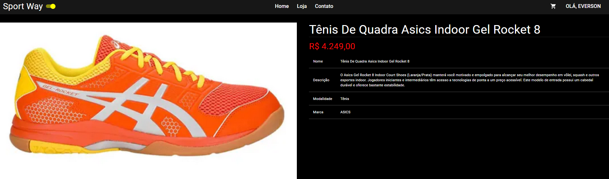

<<<<<<< HEAD
# LojaSports
=======

# Loja de Artigos Esportivos 

## Visão Geral

Sports Store é uma plataforma dedicada aos amantes de esportes, oferecendo uma ampla variedade de produtos para diversas modalidades. A loja permite que os usuários se cadastrem de forma segura, garantindo uma experiência personalizada e protegida. Os clientes podem navegar por diferentes categorias de produtos, adicioná-los ao carrinho, realizar compras de forma prática e acompanhar o status de seus pedidos.

Além disso, a plataforma oferece ferramentas de recomendação de produtos com base nas preferências dos usuários, descontos exclusivos para membros cadastrados e integração com serviços de entrega rápida. Desenvolvida seguindo as melhores práticas de segurança e design, a loja utiliza um sistema robusto de gerenciamento de usuários e pedidos, garantindo confiabilidade e eficiência.

O backend é construído com tecnologias modernas, como Spring Boot e Spring Security, enquanto o frontend é intuitivo e estilizado com React, proporcionando uma navegação fluida e visual atraente.

## Tecnologias Utilizadas

### Backend sports)

- Spring Boot 3
- Spring Security 6
- Autenticação com JWT Token
- Spring Data JPA
- Documentação com OpenAPI e Swagger UI
- Docker

### Frontend (client-ui)

- React
- Arquitetura baseada em Componentes
- Carregamento Sob Demanda (Lazy Loading)
- Guardas de Autenticação

## Objetivos de Aprendizado

Ao seguir este projeto, os alunos aprenderão:

- Design de diagrama de classes a partir de requisitos de negócios
- Segurança de aplicação usando tokens JWT com Spring Security
- Utilização de herança com Spring Data JPA
- Implementação da camada de serviços e tratamento de exceções da aplicação
- Tratamento de exceções personalizadas
- Implementação de paginação e melhores práticas de API REST
- Uso de Perfis do Spring para configurações específicas de ambiente
- Documentação de APIs com OpenAPI e Swagger UI
- Implementação de requisitos de negócios e tratamento de exceções de negócios
- Dockerização da infraestrutura

## Licença

Este projeto é licenciado sob a Apache License 2.0. Veja o arquivo [LICENSE](LICENSE) para mais detalhes.

## Iniciando o Projeto

Para começar com o projeto Book Social Network, siga as instruções de configuração nos diretórios correspondentes:

- [Instruções para Backend](/sports/README.md)
- [Instruções para Frontend](client-ui/README.md)

    
    
    
    
    
    
    
    
    
    
</>
    

    Made with 💙 by <a href="https://github.com/eversonmariano">Everson Mariano</a>

Se precisar de mais alguma coisa, é só me avisar!
