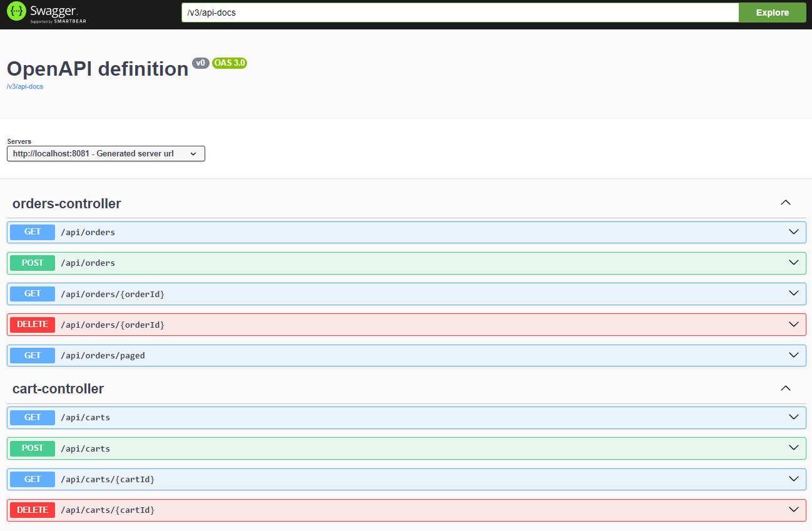
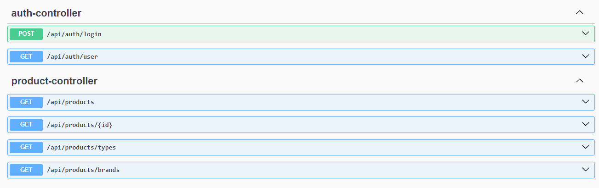
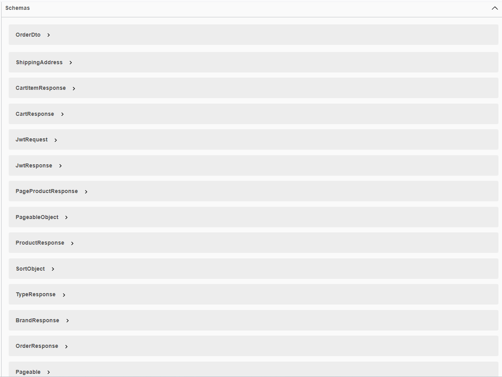

# Loja de Artigos Esportivos - Backend

## Visão geral

O backend do projeto da Loja de Artigos Esportivos **Sport Way** é responsável por manipular todas as operações do lado do servidor, incluindo autenticação de usuário, endpoints de API. Esta seção fornece uma visão geral da arquitetura de backend, tecnologias usadas e instruções de configuração.

## Tecnologias usadas:

- **Spring Boot 3**: Uma estrutura poderosa para criar aplicativos baseados em Java.
- **Spring Security 6**: Fornece mecanismos de autenticação e autorização para proteger o aplicativo.
- **JWT Token Authentication**: Garante comunicação segura entre o cliente e o servidor.
- **Spring Data JPA**: Simplifica o acesso e a persistência de dados usando a Java Persistence API.
- **JSR-303 e Spring Validation**: Habilita a validação de objetos com base em anotações.
- **OpenAPI e Swagger UI Documentation**: Gera documentação para os endpoints da API.
- **Docker**: Facilita a conteinerização do aplicativo de backend para implantação.

## Setup de Instruções

Para configurar o backend do projeto da loja de , siga estas etapas:

1. Clone o repositório:

```bash
   git clone git@github.com:eversonmariano/LojaSports.git
```

2. Entre no diretório docker e execute o docker-compose.yml file

```bash
  Docker compose up -d
```

3. Navegue até o diretório sports:

```bash
  cd sports
```

4. Instalar dependências (assumindo que o Maven esteja instalado):

```bash
  mvn clean install
```

4. Execute o aplicativo, mas primeiro substitua o `x.x.x` com a versão atual do arquivo `pom.xml`

```bash
  java -jar target/book-network-api-x.x.x.jar
```

5. Acesse a documentação da API usando Swagger UI:

Abra seu navegador em: `http://localhost:8081/swagger-ui/index.html#/.

<p align="center">
    
    
    
</>

## Licença

Este projeto é licenciado sob a Apache License 2.0. Veja o arquivo [LICENSE](LICENSE) para detalhes.

